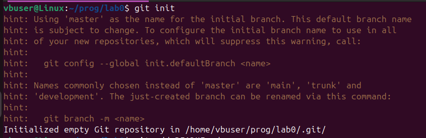
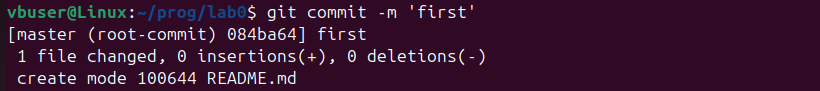
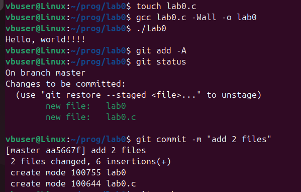
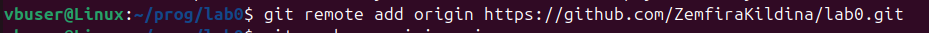
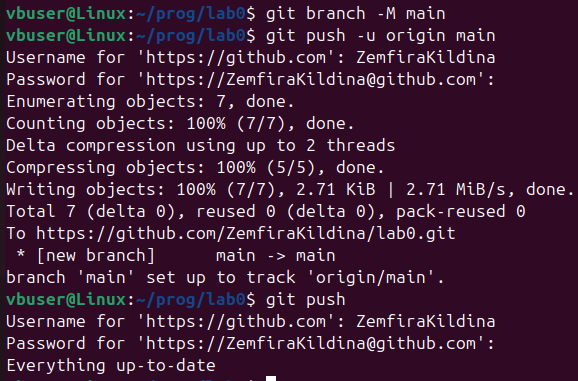

# Отчет
## Задание

1. Создать репозиторий на `GitHub`.
2. Склонировать его себе на ПК.
3. Написать свою первую программу.
4. Скомпилировать и запустить ее.
5. Получить по отдельности результаты кажого этапа компиляции.
6. Написать отчет `README.md`. Отчёт должен содержать:
    - Задание
    - Описание проделанной работы
    - Консольные команды
    - Скриншоты результатов
    - Ссылки на используемые материалы

7. Сделать коммит и пуш.
8. Добавить для себя в отчет шпараглку по работе с `git`.

## Описание проделанной работы

1. Создан репозиторий на `GitHub`
2. Создали папку лаборторной работы на компьютере
3. Внутри папки сделан репозиторий с помощью команды в терминале `git init`(фото 1)
4. Создан тектовый файл ``README.md`` и открыт с помощью `VSCodium`
5. Файл `README.md` добавлен к отслеживанию командой ``git add README.md``(фото 2)
6. Зафиксировали изменения командой ``git commit -m "first"``(фото 3)
7. Написали первую программу, добавили к отслеживанию и зафиксировалии изменения (фото 4)
8. Подключили удаленный репозиторий к локальному командой ``git remote add <name> <url>``(фото 5)
9. Создали главную ветку командой ``git branch -M main`` и отправили ее на GitHub - ``git push -u origin main``(фото 6)

## Скриншоты результатов
### Фото 1



### Фото 2


### Фото 3



### Фото 4



### Фото 5



### Фото 6



### Первая программа

```C
#include <stdio.h>
int main()
{
    printf("Hello, world!!!! \n");
    return 0;
}
```

## Ссылки на используемые материалы

[Язык разметки MarkDown](https://doka.guide/tools/markdown/)
[Первые шаги в GitHub](https://habr.com/ru/companies/yandex_praktikum/articles/700708/)
[Основы Git](https://git-scm.com/book/ru/v2)
[Что такое Git и для чего он нужен](https://practicum.yandex.ru/blog/chto-takoe-git-i-dlya-chego-nuzhen/)

# Шпаргалка по работе с `git`

- `git init` установить репозиторий
- `git add название файла` добавить файл в репозиторий 
- `git commit -m "first commit"` сделать комментарий и зафиксировать 
- `git add . ` добавить все файлы в репозиторий 
- `git commit -m "info"` зафиксировать изменения в репозитории(в "" название фиксации)
- `git push` отправить в репозиторий 
- `git branch -M main` создать главную ветку 
- `git remote` показать репозиторий
- `git clone` работа со своим репозиторием с другого устройства
- `git remote add <name> <url>` подключить удаленный репозиторий к локальному
